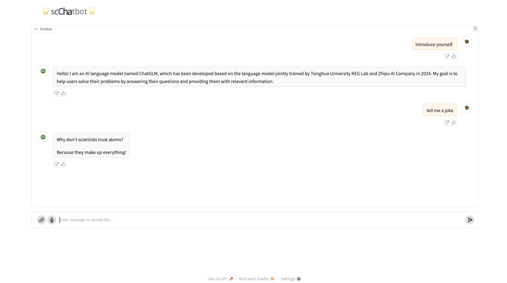

## scChatBot

The **Single Cell ChatBot** is an interactive application built with [Gradio](https://gradio.app/) and [ZhipuAI](https://www.bigmodel.cn), designed to provide conversational capabilities. This chatbot supports multimodal inputs, including text and files, and offers a responsive, avatar-based interface.

## Features

- **Multimodal Input**: Users can interact with the chatbot via text or upload files (e.g., documents, images, or audio).
- **Real-Time Streaming**: Responses are streamed character by character for a natural conversational experience.
- **Like/Dislike Feedback**: Users can provide feedback on responses.

Working on add text to image features on webVersion...

## Installation

All required packages is in `install.txt`.

`conda create -n chatbot_env python=3.10`

`conda activate chatbot_env`

`pip install gradio`

`pip install zhipuai`

Now all required packages is installed, you need to get your own ZHIPU API from https://open.bigmodel.cn and run `python chatbot.py` to get start to explore!

